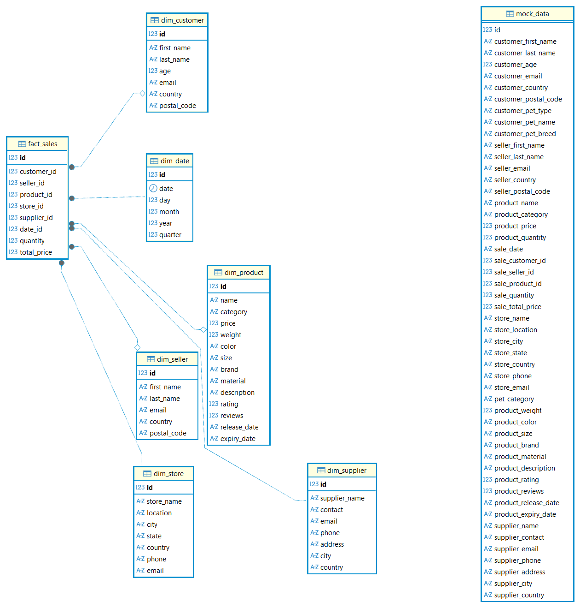
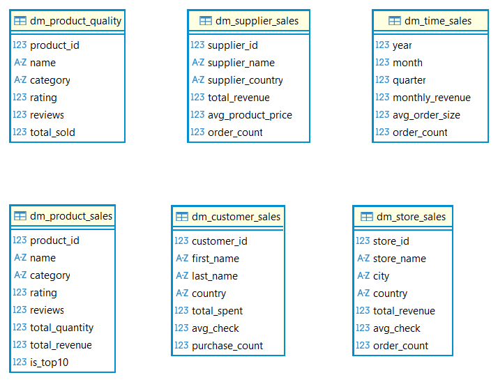
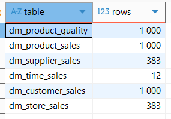
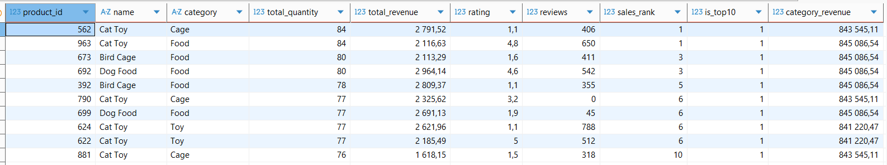

# Лабораторная работа №2 — ETL с Apache Spark

## Цель работы

Реализовать ETL-пайплайн с помощью Apache Spark, который:
1. Трансформирует исходные данные из плоских CSV-файлов в модель «звезда» в PostgreSQL
2. На основе модели «звезда» создаёт 6 аналитических витрин данных в ClickHouse

---

## Стек технологий

| Компонент | Версия | Назначение |
|---|---|---|
| Apache Spark | 3.5.0 | ETL-обработка данных |
| PostgreSQL | 15 | Хранение модели звезда |
| ClickHouse | latest | Хранение аналитических витрин |
| Docker | — | Контейнеризация всех сервисов |
| Python | 3.x | Язык написания Spark-джобов |

---

## Архитектура решения

```
CSV файлы (10 x 1000 строк)
        │
        ▼
  PostgreSQL (mock_data)
        │
        │  Spark Job 1: etl_to_star.py
        ▼
  PostgreSQL — Модель Звезда
  ┌─────────────┐
  │  fact_sales │
  └──────┬──────┘
         ├── dim_customer
         ├── dim_seller
         ├── dim_product
         ├── dim_store
         ├── dim_supplier
         └── dim_date
        │
        │  Spark Job 2: etl_to_clickhouse.py
        ▼
  ClickHouse — 6 витрин данных
  ├── dm_product_sales
  ├── dm_customer_sales
  ├── dm_time_sales
  ├── dm_store_sales
  ├── dm_supplier_sales
  └── dm_product_quality
```

---

## Инструкция по запуску

### 1. Запуск контейнеров

```powershell
docker-compose up -d
```

Проверить что все контейнеры запущены:
```powershell
docker ps
```

Должны быть запущены:
- `lab2_postgres` — PostgreSQL
- `lab2_spark_master` — Spark Master (UI: http://localhost:8080)
- `lab2_spark_worker` — Spark Worker
- `lab2_clickhouse` — ClickHouse

### 2. Загрузка исходных данных в PostgreSQL

```powershell
.\load_csv.ps1
```


### 3. Скачивание JDBC драйверов (один раз)

```powershell
.\download_jars.ps1
```

### 4. Запуск Spark Job 1 — ETL в модель звезда

```powershell
docker exec lab2_spark_master /opt/spark/bin/spark-submit `
  --master spark://spark-master:7077 `
  --jars /spark-jobs/jars/postgresql-42.7.3.jar `
  /spark-jobs/etl_to_star.py
```

### 5. Запуск Spark Job 2 — ETL отчётов в ClickHouse

```powershell
docker exec lab2_spark_master /opt/spark/bin/spark-submit `
  --master spark://spark-master:7077 `
  --jars /spark-jobs/jars/postgresql-42.7.3.jar,/spark-jobs/jars/clickhouse-jdbc-0.6.0-all.jar `
  /spark-jobs/etl_to_clickhouse.py
```

---

## Результаты выполнения

### Модель звезда в PostgreSQL

Схема базы данных `lab2` с таблицами измерений и таблицей фактов:



### Витрины данных в ClickHouse

Схема базы данных `default` с 6 витринами:



Количество строк в каждой витрине:




### Пример данных — витрина продаж по продуктам

Топ-10 и выручка по категориям (`dm_product_sales`):



```sql
SELECT product_id, name, category, total_quantity, total_revenue, rating, reviews, sales_rank, is_top10, category_revenue FROM dm_product_sales ORDER BY sales_rank LIMIT 10
```

---

## Проверка результатов

### PostgreSQL
- Host: `localhost`, Port: `5432`
- Database: `lab2`, User: `user`, Password: `password`

```sql
SELECT 'fact_sales'    AS t, COUNT(*) FROM fact_sales
UNION ALL SELECT 'dim_product',  COUNT(*) FROM dim_product
UNION ALL SELECT 'dim_customer', COUNT(*) FROM dim_customer
UNION ALL SELECT 'dim_store',    COUNT(*) FROM dim_store
UNION ALL SELECT 'dim_supplier', COUNT(*) FROM dim_supplier
UNION ALL SELECT 'dim_date',     COUNT(*) FROM dim_date;
```

### ClickHouse
- Host: `localhost`, Port: `8123`
- Database: `default`, User: `default`, Password: *(пусто)*

```sql
SELECT 'dm_product_sales'  AS table, COUNT(*) AS rows FROM dm_product_sales  UNION ALL
SELECT 'dm_customer_sales',           COUNT(*)         FROM dm_customer_sales UNION ALL
SELECT 'dm_time_sales',               COUNT(*)         FROM dm_time_sales     UNION ALL
SELECT 'dm_store_sales',              COUNT(*)         FROM dm_store_sales    UNION ALL
SELECT 'dm_supplier_sales',           COUNT(*)         FROM dm_supplier_sales UNION ALL
SELECT 'dm_product_quality',          COUNT(*)         FROM dm_product_quality;
```

---

## Остановка

```powershell
docker-compose down
```
